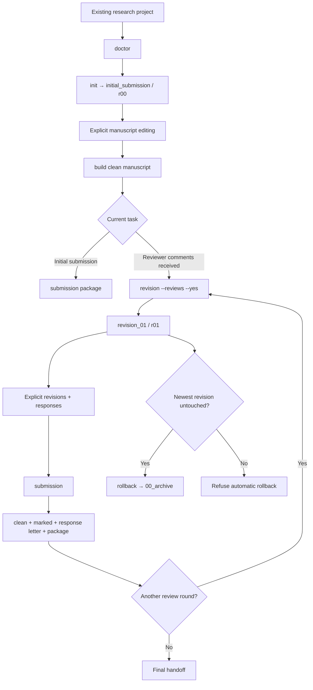

import AcademicCallout from '@/components/AcademicCallout.astro';
import ResponsiveTable from '@/components/ResponsiveTable.astro';

LaTeX 已经很好地解决了科研论文的排版问题，但一篇论文从初稿进入投稿、返修、再次投稿直至最终归档后，工程复杂性会迅速增加。研究者需要同时维护干净稿、修订标记稿、审稿回复、参考文献、作者信息、投稿附件和不同轮次的源文件；一旦再引入 LLM/Agent，版本身份、修改授权和修改来源还会进一步变得模糊。

[`sci-manuscript-skill`](https://github.com/cigit-zgy/sci-manuscript-skill) 是我为这一问题设计的一套 LaTeX 科研稿件生命周期工作流。它的目标很具体：**让稿件的工程操作可复现、可追踪、可回滚，同时把科研内容的决定权留在研究者手中。** 项目提供同一套实现支持的 CLI 和 Python API，并通过 `SKILL.md` 约束 Agent 如何调用这些能力。

<AcademicCallout kind="definition">
  本文所说的**稿件生命周期工程（manuscript lifecycle engineering）**，指对稿件初始化、编译、版本演化、审稿回复、差异追踪、参考文献同步、回滚、重编号和投稿打包等操作建立明确的状态、规则和产物契约。它管理稿件的工程状态，不替代科学判断。
</AcademicCallout>

## 为什么要做这套工作流

科研写作中的很多错误与论文本身的科学内容无关。它们来自“文件和状态没有被严格定义”。例如，第三轮返修究竟基于第二轮的哪个文件继续修改；某段蓝色文字对应哪条 reviewer comment；删除内容如何进入 marked manuscript；回滚一次误创建的 revision 会不会误删已经修改的源文件；重新编号后父子版本是否仍然一致。这些问题在手工管理少量文件时看起来简单，但随着返修轮次和投稿附件增加，很容易形成隐含状态。

<ResponsiveTable variant="minimal">

| 常见问题 | 直接后果 | `sci-manuscript-skill` 的处理 |
| :-- | :-- | :-- |
| 版本名称和父版本依赖人工记忆 | 可能从错误版本继续修改 | 固定 `r00 → r01 → r02` 的相邻版本关系 |
| Agent 获得文件访问权后顺手润色正文 | 科研内容的授权边界消失 | Skill 明确禁止 Agent 自主修改 manuscript content |
| clean、marked、response 和 submission 分散生成 | 很难确认某套文件是否来自同一轮 | 每轮按固定 artifact contract 构建 |
| 手工删除或重命名 revision | 可能丢失已编辑稿件 | rollback 使用源文件摘要保护，reindex 采用归档与事务式替换 |
| 每个 revision 复制一份 bibliography 和作者信息 | 共享信息逐轮漂移 | `references/` 只在稿件根目录保留一份 |
| 编译中间文件长期留在项目里 | 工作区污染，人工难以区分正式产物 | `tmp/` 按需创建，成功后自动清理 |

</ResponsiveTable>

因此，这个项目首先解决的是**状态管理和责任边界**。如果这些基础问题没有处理清楚，让 Agent 直接“管理论文”反而会增加不确定性。

## 设计原则：把内容控制与工程自动化分开

整个系统最重要的一条规则写在 `SKILL.md` 的最高优先级位置：Agent 不得自主修改论文内容。`build`、`revision`、`rollback`、`reindex`、`sync-bib` 或 `submission` 都只是工程操作，不构成修改正文的授权；reviewer comment 本身也不等于编辑许可。

这条规则决定了后面的架构。研究者拥有 `manuscript.tex`、章节、图表、回复正文和 cover letter 正文；程序负责检查状态、创建合法版本、编译、计算差异、定位行号和组织最终提交物。换句话说，系统自动化的是**确定性操作**，科学解释和文字修改仍然需要显式输入或确认。

<ResponsiveTable variant="minimal">

| 设计原则 | 实现方式 | 主要控制的风险 |
| :-- | :-- | :-- |
| 内容所有权明确 | `manuscript.tex` 和用户编辑内容从不被 build 覆盖 | Agent 或构建工具越权改稿 |
| 版本身份确定 | `initial_submission = r00`，后续为固定宽度 `revision_01 = r01` | “当前到底是哪一版”的歧义 |
| 单一共享来源 | 作者库、BibTeX 和 revision style 只位于根 `references/` | 多轮复制产生不一致 |
| 差异只比较相邻版本 | marked manuscript 始终比较直接父版本和当前版本 | 跨轮 diff 造成来源混淆 |
| 破坏性操作可验证 | rollback 检查 digest；reindex 先归档再事务式替换 | 误删、错误重编号 |
| 正式产物与临时文件分离 | 正式文件进入 `output/` / `submission/`，中间文件进入 `tmp/` | 工作区逐渐失去可读性 |

</ResponsiveTable>

## 系统架构：Skill 负责约束，Python package 负责执行

项目刻意把“Agent 应该怎么做”和“程序具体怎么做”分成两层。`SKILL.md` 是行为契约，负责识别用户意图、选择命令、声明禁止事项，并规定什么时候必须获得确认；`sci_manuscript` Python package 才承担 workspace 操作、metadata 校验、编译、diff、response 组装和 artifact 发布。CLI 与 Python API 最终调用同一套实现，因此命令行使用和 Agent 调用不会形成两套彼此漂移的业务逻辑。

<ResponsiveTable variant="minimal">

| 层次 | 主要对象 | 职责 |
| :-- | :-- | :-- |
| Agent contract | `SKILL.md`、`references/workflow.md` | 请求路由、授权边界、操作前确认、handoff 检查 |
| Execution API | CLI、`ManuscriptProject` Python API | 对外提供稳定的生命周期操作入口 |
| Domain logic | workspace、metadata、compile、diff、response | 执行版本约束、构建、差异与回复组织 |
| Runtime resources | publisher classes、correspondence templates | 随 package 安装，构建时临时调用 |
| User workspace | `manuscript/` | 保存研究者拥有的稿件、图表、metadata、回复和正式产物 |

</ResponsiveTable>

这个拆分还有一个实际好处：生成的论文项目不依赖 `sci-manuscript-skill` 的源码 checkout，也不会在每个项目里复制一份 `run.py`。工作流能力来自已安装 package，稿件目录因此可以保持相对稳定和精简。

## 稿件在磁盘上如何组织

初始化不会接管整个科研项目。它只在已有项目中建立一个 `manuscript/` 工作区；如果该目录已经存在，初始化会拒绝覆盖。根目录的 `references/` 保存所有轮次共享的信息，revision 目录只保存该轮自己的稿件状态、回复和投稿材料。

```text
existing-project/
└── manuscript/
    ├── 00_archive/
    ├── references/
    │   ├── authors.yaml
    │   ├── references.bib
    │   └── revision_style.tex
    ├── initial_submission/          # r00
    │   ├── meta.yaml
    │   ├── manuscript.tex
    │   ├── sections/
    │   ├── figures/
    │   ├── tables/
    │   ├── output/
    │   └── submission/
    └── revision_01/                # r01
        ├── meta.yaml
        ├── revision_creation.yaml
        ├── manuscript.tex
        ├── sections/
        ├── figures/
        ├── tables/
        ├── response/
        │   ├── reviewer_comments.md
        │   └── responses.tex
        ├── output/
        └── submission/
            └── cover_letter_body.tex
```

这个结构刻意避免把 publisher class、临时 flattened TeX 或运行脚本复制到每篇论文。内置 publisher resources 随 Python package 安装，在构建阶段临时使用；只有自定义 publisher 才会创建项目级 `journal_template/`。这样做的目的，是让工作目录主要保存**研究者真正拥有和需要审阅的文件**。

## 生命周期：每一步都对应明确的状态转换

一篇稿件从 `r00` 开始。初稿可以直接构建 clean manuscript 和 initial submission package；收到审稿意见后，`revision` 只允许创建紧邻当前版本的下一轮。新 revision 继承上一轮正文内容，但会移除已经完成使命的 provenance wrapper，并建立新的 response workspace。

<figure>
  
  <figcaption><strong>Figure 1.</strong> `sci-manuscript-skill` 的稿件生命周期。正常路径保持相邻 revision；rollback 只允许作用于尚未被编辑的最新 revision。</figcaption>
</figure>

<details>
<summary>Mermaid source</summary>



</details>

版本关系本身很简单：

```text
initial_submission (r00)
        ↓
revision_01 (r01)
        ↓
revision_02 (r02)
        ↓
...
```

这种“只允许相邻演化”的限制看起来保守，但它使 marked manuscript 的比较对象、response location 和 revision provenance 都具有唯一解释。

## 审稿修改如何追踪来源

返修阶段最容易出现的另一个问题，是“改了什么”和“为什么改”混在一起。项目只定义两种手工 provenance wrapper：

```latex
\review{1-1}{Text revised in response to Reviewer 1, Comment 1.}

\user{Additional text introduced by the authors.}
```

删除内容不要求用户额外标记，直接由相邻版本之间的 `latexdiff` 检测。当前实现的 marked manuscript 使用蓝色表示 reviewer-linked addition、绿色表示 user-initiated addition、红色表示 deletion。

<ResponsiveTable variant="minimal">

| 修改来源 | manuscript 中的表达 | marked manuscript | 用途 |
| :-- | :-- | :-- | :-- |
| 针对 reviewer/editor 的新增或修改 | `\review{ID}{...}` | 蓝色 | 将正文修改与具体 comment 建立对应 |
| 作者主动增加的内容 | `\user{...}` | 绿色 | 与审稿要求驱动的修改区分 |
| 删除 | 直接删除原文 | 红色 `latexdiff` | 避免人为维护删除 wrapper |

</ResponsiveTable>

reviewer comment 还可以显式声明为 `manuscript_revised` 或 `response_only`。前者要求对应 ID 至少出现在一个 `\review{...}` 中，并在 response letter 中使用 marked manuscript 的真实行位置；后者只要求回复，不产生正文位置。由此，response letter 中的“修改位置”来自最终 marked PDF，而非人工填写一个可能已经过期的行号。

## 为什么 rollback 和 reindex 要做得这么谨慎

版本管理中风险最高的环节通常出现在删除和重新编号，因为这两类操作可能直接影响已经形成的科研源文件。`revision_creation.yaml` 会记录受保护用户源文件的摘要。`rollback` 只有在最新 revision 的摘要没有变化时才允许自动归档；一旦研究者已经修改过该轮源文件，程序会拒绝自动 rollback。

`reindex` 的约束更严格。系统先把受影响 revision 复制到 `00_archive/`，再准备重编号后的版本，检查科学源文件摘要，最后进行目录替换；如果事务中途失败，应恢复原布局。这里的设计重点是：**编号整齐的价值低于科研源文件的完整性。**

这种策略也说明了项目的定位。设计范围集中在论文生命周期中最容易误操作的少数场景，并为这些场景定义更窄、更可验证的操作语义；Git 仍然负责通用版本控制。

## 从零开始如何使用

项目要求 Python 3.11+、PyYAML、LaTeX 工具链、`latexdiff` 和 Poppler。Tectonic 是首选的紧凑编译引擎；传统工具链可以使用 `latexmk`，中文稿件使用 XeLaTeX/xeCJK。第一次使用建议先运行环境检查。

```bash
git clone https://github.com/cigit-zgy/sci-manuscript-skill.git
cd sci-manuscript-skill
python -m pip install .

sci-manuscript doctor
```

如果准备中文稿件，可以额外执行真实的 CJK 编译与字形检查：

```bash
sci-manuscript doctor --language zh
```

作者信息可以配置为用户级、无论文角色的复用库。每篇论文在初始化时再明确选择第一作者、通讯作者和其他作者，避免把“这个人是谁”和“这个人在本论文中承担什么角色”绑定在一起。

```bash
sci-manuscript authors configure ~/authors.yaml
sci-manuscript authors list
```

随后初始化稿件：

```bash
sci-manuscript init \
  --project /path/to/existing-project \
  --title "Manuscript title" \
  --journal "Target Journal" \
  --publisher elsevier \
  --language en \
  --article-type "Research Article" \
  --first-author first_author \
  --corresponding-author corresponding_author
```

当前内置四类 publisher resources：Elsevier `elsarticle`、Springer Nature `sn-jnl`、ACS `achemso`，以及一个通用中文期刊起点 `kxtbcas`。中文资源的定位是通用 starting point，不代表所有中文期刊的官方模板。

日常构建只需要：

```bash
sci-manuscript status --project /path/to/existing-project
sci-manuscript build --project /path/to/existing-project
```

收到审稿意见后，将评论整理为 Markdown，再显式创建下一轮 revision：

```bash
sci-manuscript revision \
  --project /path/to/existing-project \
  --reviews /path/to/reviewer_comments.md \
  --yes
```

完成**经过研究者确认的正文修改和回复**后，执行：

```bash
sci-manuscript submission --project /path/to/existing-project
```

对于 revision，这一步会组织出 clean manuscript、adjacent marked manuscript、response letter 以及 version-local submission package。需要更新共享 BibTeX 时使用：

```bash
sci-manuscript sync-bib \
  --project /path/to/existing-project \
  --bib /path/to/export.bib
```

它只使用用户明确给出的 BibTeX export，不会连接 Zotero 进程或网络服务。

## 命令与职责

<ResponsiveTable variant="minimal">

| 命令 | 职责 | 是否修改科研正文 |
| :-- | :-- | :--: |
| `doctor` | 检查依赖与真实编译环境 | 否 |
| `authors configure/list/show` | 管理可复用作者资料 | 否 |
| `init` | 创建并编译 `r00` 工作区 | 否 |
| `status` | 报告当前轮次、父版本和正式产物 | 否 |
| `build` | 编译当前 clean manuscript | 否 |
| `revision` | 经确认创建唯一的下一轮 revision | 否 |
| `submission` | 构建当前轮正式投稿相关产物 | 否 |
| `rollback` | 归档未编辑的最新 revision | 否 |
| `reindex` | 事务式修复 revision 编号间隙 | 否 |
| `sync-bib` | 原子替换共享 bibliography | 否 |

</ResponsiveTable>

这张表也是整个 Skill 的基本边界：这些命令处理**稿件状态**，正文修改仍然属于研究者或被明确授权的编辑动作。

## 如何验证这套工作流

如果一个工具强调“可复现”，仅有目录设计和命令约定还不够，关键操作需要通过真实工具链验证。项目的 release gate 分成三个层次：代码层检查 Python 语法、格式、lint、类型和 package build；工作流层在真实 LaTeX、`latexdiff` 和 Poppler 环境中执行匿名的 `r00 → r01 → r02` 生命周期；产物层继续检查 marked PDF 的颜色来源、response location、rollback/reindex 安全性、临时文件清理和页面渲染结果。

<ResponsiveTable variant="minimal">

| 验证层次 | 代表性检查 | 想回答的问题 |
| :-- | :-- | :-- |
| 代码质量 | `pytest`、Ruff、mypy、wheel build | 实现是否满足静态和单元级约束 |
| 生命周期 | `r00 → r01 → r02` E2E、rollback、reindex | 状态转换是否按契约执行 |
| LaTeX 工具链 | publisher compilation、`latexdiff`、Poppler | 在真实外部依赖下能否得到目标产物 |
| PDF 产物 | 修改颜色、行位置、overfull box、页面检查 | 最终交给研究者的文件是否可读且来源一致 |

</ResponsiveTable>

这套验证仍然有明确边界。它能证明“程序按照定义生成了这些文件”，无法证明“论文中的科学结论正确”或“回复策略一定能说服审稿人”。工程验证与科学有效性需要分别判断，这一点在科研工具中尤其重要。

## 我刻意没有让它做什么

一个科研工作流的可信度也取决于它拒绝承担哪些职责。当前项目不会自行生成或润色 scientific prose，不会判断 reviewer comment 应该如何回答，也不会根据缺失信息推断作者身份、科学结论或投稿策略。它同样没有宣称四套 publisher resources 可以覆盖所有期刊的特殊要求；自定义期刊仍然需要真实模板和人工核对。

<AcademicCallout kind="caution">
  这套工具不能替代研究者对科学内容、期刊政策和最终 PDF 的审阅。自动化可以降低文件管理和重复构建的风险，但无法证明一篇论文的科学论证正确。
</AcademicCallout>

项目在 release gate 中会运行代码检查、类型检查、构建 wheel，并在真实 LaTeX/`latexdiff`/Poppler 工具链上执行匿名的 `r00 → r01 → r02` 生命周期测试，检查 rollback/reindex、安全清理和 marked PDF 的修改来源。这里验证的是**工作流实现是否满足自己的契约**，不涉及论文科学内容的正确性。

## 结语

`sci-manuscript-skill` 的设计出发点很朴素：科研论文已经是一个需要多轮演化、多人审阅和多种正式产物的长期对象，因此它值得拥有明确的生命周期模型。对于 Agent 环境，这种明确性更加重要。Agent 可以承担编译、状态检查、版本创建、差异定位和打包等机械工作；研究者保留对正文、回复和科学判断的控制权。

从这个角度看，Skill 的价值主要体现在：把一组原本依赖记忆和习惯的操作变成**有边界、可检查、可复现的科研工程流程**，“自动写完论文”并非其设计目标。如果后续继续扩展，我仍会优先维护这条原则：增加自动化之前，先定义状态、所有权、失败条件和可恢复路径。

## References

1. [cigit-zgy/sci-manuscript-skill](https://github.com/cigit-zgy/sci-manuscript-skill)
2. [Fenng/Tech-Doc-Style-Chinese](https://github.com/Fenng/Tech-Doc-Style-Chinese)
