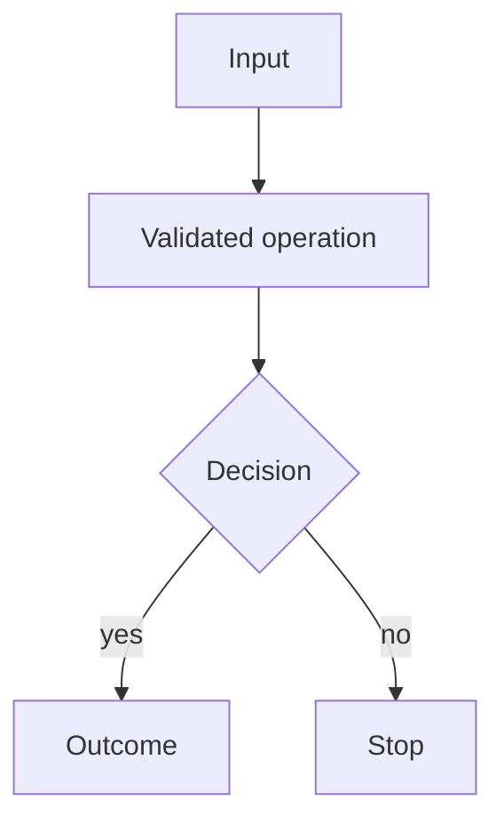

# Diagram authoring and rendering

The blog supports two diagram-as-code formats only: Mermaid and PlantUML.

## Selection

- Mermaid: workflow, process, architecture overview, compact directed flow.
- PlantUML: sequence, component, class, state, and UML-style interaction diagrams.

## Publication geometry

- Target visible width: 680–760 px.
- Prefer one compact diagram per figure.
- Reorganize the graph before increasing width or node spacing.
- Keep labels short; split long labels over two lines.
- Published pages use local static SVG only.

## Typography contract

Diagrams do not own a separate font system. They reuse the blog typography roles exactly:

- ordinary Latin text: `Latin Modern Sans`;
- Chinese/CJK glyphs: `LXGW WenKai Screen`;
- bold labels/headings: the same UI stack at the site-defined bold weight;
- monospaced identifiers/code: `Maple Mono`, falling back to `LXGW WenKai Screen` for CJK;
- mathematics: KaTeX remains the owner of mathematical typography and should not be imitated inside diagram templates.

The renderer CI installs the same pinned font versions used by the site before Mermaid or PlantUML lays out text. Published pages render generated SVGs through `DiagramFigure.astro`, which inlines each trusted local SVG at Astro build time. This is intentional: an SVG loaded as a standalone `` document cannot reliably inherit the page's self-hosted web fonts, while an inline SVG can use the exact `--font-ui` and `--font-mono` tokens already loaded by the blog.

Do not hardcode Noto, Arial, Helvetica, system-ui, or another diagram-only font in a published template. Do not add a new font solely for diagrams.

## Mermaid template

Use `mermaid.config.json` for all shared styling. Keep diagram source semantic and small.



Recommended flowchart rules:

- `htmlLabels: false`
- `nodeSpacing: 22`
- `rankSpacing: 28`
- `curve: linear`
- avoid deeply nested subgraphs
- use a maximum of roughly 8–12 primary nodes in one figure

Render command used by CI:

```bash
mmdc \
  -i src/diagrams/<name>.mmd \
  -o public/figures/<name>.svg \
  -c src/diagrams/mermaid.config.json \
  -b '#111113' \
  -w 760
```

## PlantUML template

Include the shared theme at the top of every source file.

```plantuml
@startuml
!include plantuml-theme.puml
actor Supervisor
participant Agent
participant "Scientific API" as API
Supervisor -> Agent : Request
Agent -> API : Validated operation
API --> Agent : Result
Agent --> Supervisor : Report
@enduml
```

Keep sequence diagrams to about 4–6 participants. Use `scale max 760 width` when a diagram would otherwise grow wider than the reading column.

CI renders PlantUML with a pinned PlantUML JAR. The JAR is downloaded only during the renderer job and is not committed to the repository.

## Theme

Both formats use the same semantic palette:

- background: `#111113`
- elevated surface: `#1C1C1E` / `#242426`
- primary interaction: `#0A84FF`
- secondary interaction: `#64D2FF`
- decision/group accent: `#BF5AF2`
- success/output accent: `#30D158`
- caution/rollback accent: `#FF9F0A`
- primary text: `#F5F5F7`
- muted line/text: `#8E8E93` / `#AEAEB2`

These colours match the blog's Apple/Liquid Glass dark semantic system while keeping diagrams visually flatter than the navigation chrome.
